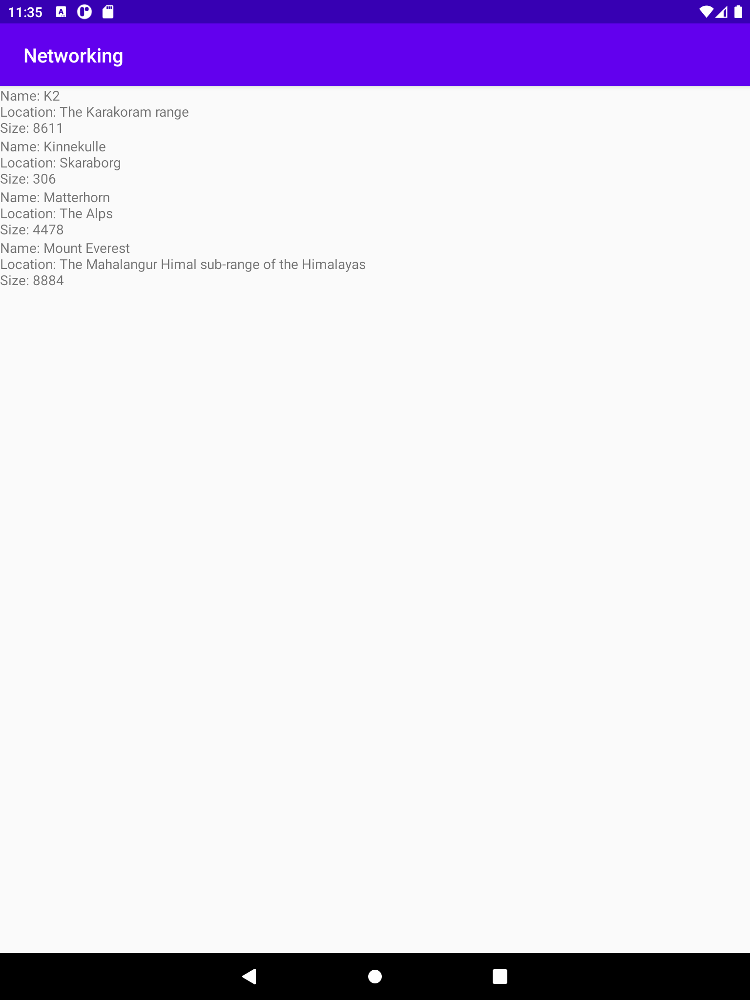

# Rapport

Ett program som visar information utifrån hämtad data från en webplats.
I activity har en recyclerview lagts till, följt av en ny xml fil vid namn list_items där textviewen ligger.
Sedan har en recycler adapter tillagts för att kunna hantera information. Där vi har en ArrayList för objekten Mountain.
Där existerar en bind på följande sätt:

```java
public void onBindViewHolder(@NonNull recyclerAdapter.MyViewHolder holder,int position){
        String name=mountainList.get(position).getName();
        String location=mountainList.get(position).getLocation();
        int size=mountainList.get(position).getSize();
        holder.mountainText.setText("Name: "+name+"\nLocation: "+location+"\nSize: "+size);
}
```

Vilket även visar vilka element som ska visas i programmet, där name, location och size är valda.
Sedan i main activity har vi hur informationen som hämtas från webbplatsen ska haneras:
```java
public void onPostExecute(String json) {
        Log.d("MainActivity", json);
        Gson gson = new Gson();
        Type type = new TypeToken<ArrayList<Mountain>>() {}.getType();
        ArrayList<Mountain> listOfMountains = gson.fromJson(json, type);
        mountainList.addAll(listOfMountains);
        adapter.notifyDataSetChanged();
    }
```

Programmet ser då ut på detta sätt:




